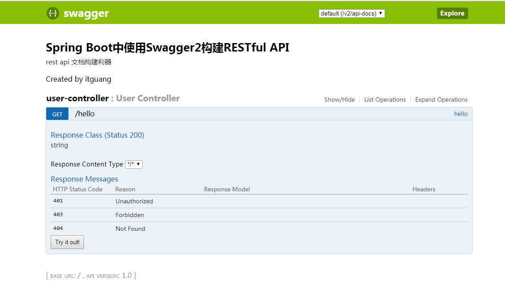
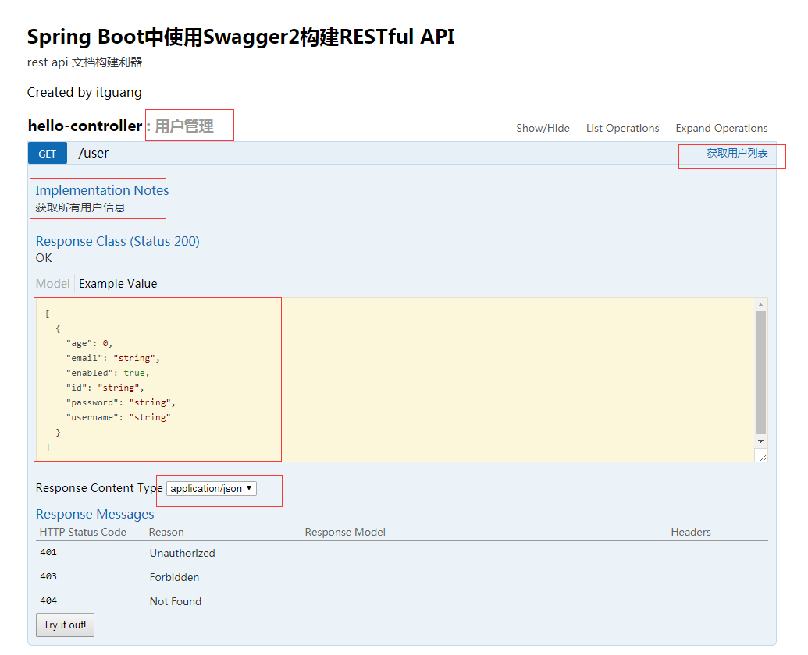
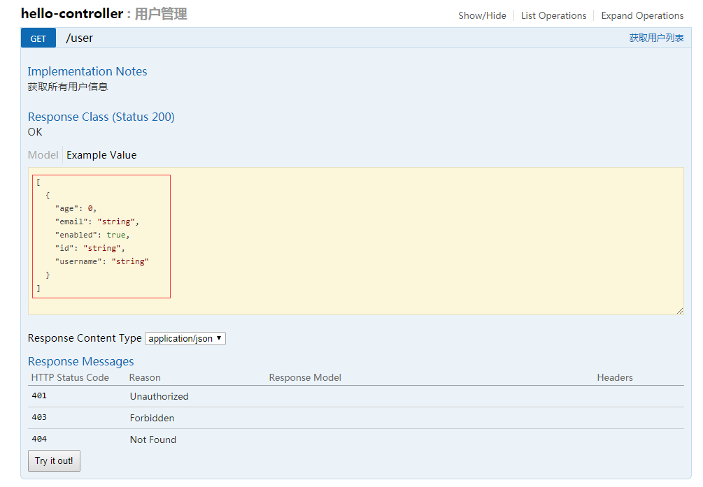
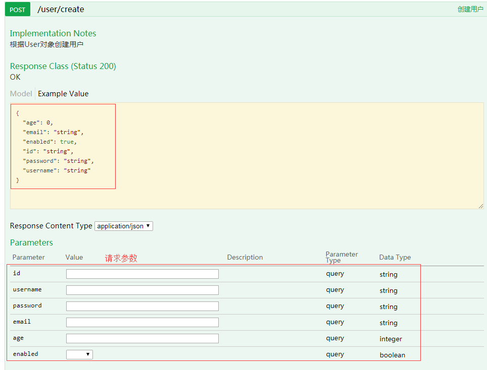
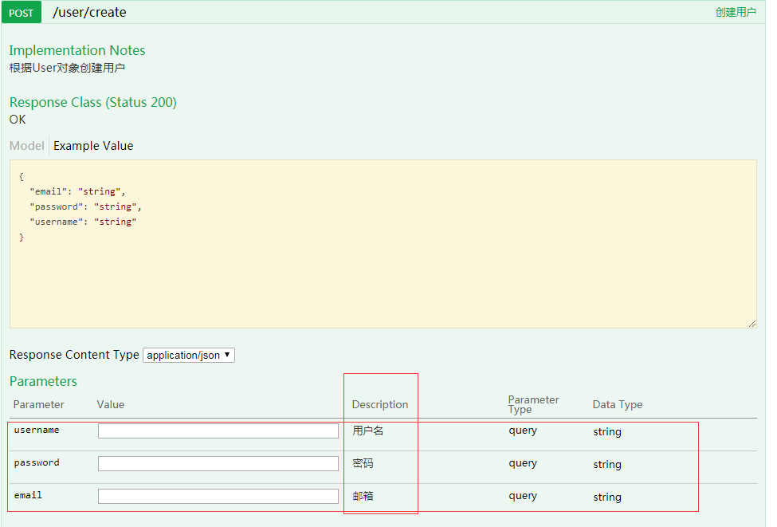
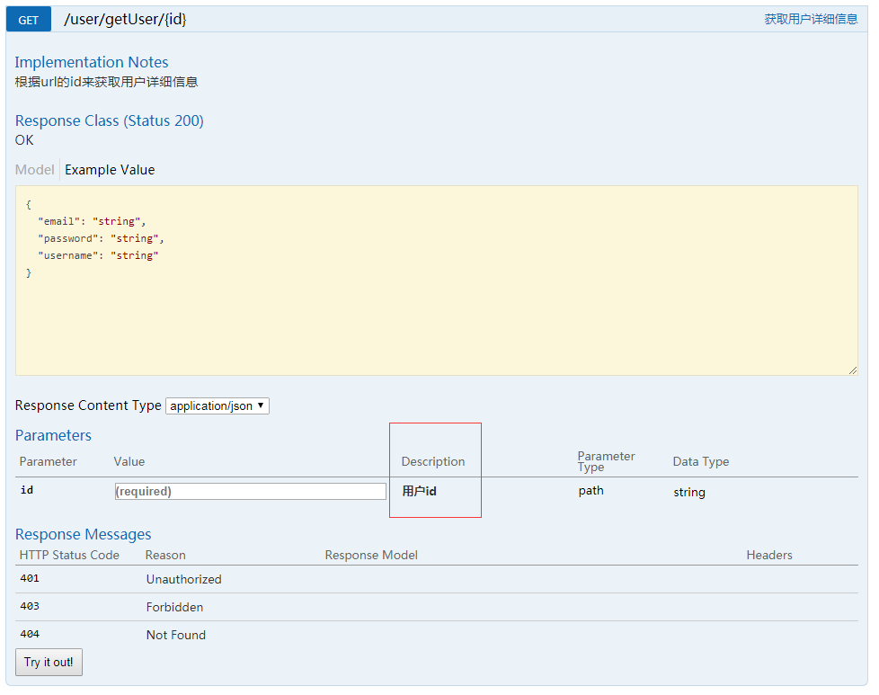
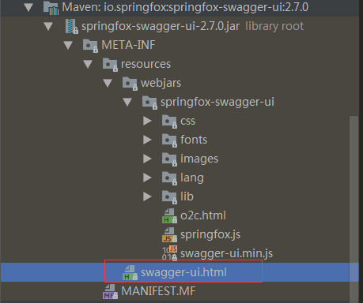
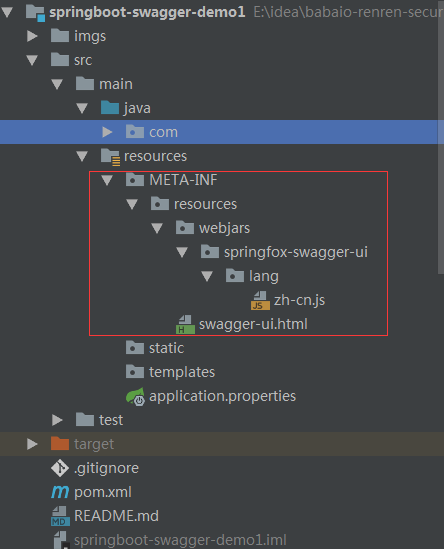

# Swagger使用

## Swagger有什么用?

swagger是一个流行的API开发框架，这个框架以“开放API声明”（OpenAPI Specification，OAS）为基础，
对整个API的开发周期都提供了相应的解决方案，是一个非常庞大的项目（包括设计、编码和测试，几乎支持所有语言）。

Swagger 是一个规范和完整的框架，用于生成、描述、调用和可视化 RESTful 风格的 Web 服务。
总体目标是使客户端和文件系统作为服务器以同样的速度来更新。
文件的方法，参数和模型紧密集成到服务器端的代码，允许API来始终保持同步。Swagger 让部署管理和使用功能强大的API从未如此简单。

**springfox大致原理:**

springfox的大致原理就是，在项目启动的过种中，spring上下文在初始化的过程，
框架自动跟据配置加载一些swagger相关的bean到当前的上下文中，并自动扫描系统中可能需要生成api文档那些类，
并生成相应的信息缓存起来。如果项目MVC控制层用的是springMvc那么会自动扫描所有Controller类，并生成对应的文档描述数据.

该数据是json格式，通过路径：项目地址/ v2/api-docs可以访问到该数据，然后swaggerUI根据这份数据生成相应的文档描述界面。
因为我们能拿到这份数据，所以我们也可以生成自己的页面.

## SpringBoot 与 Swagger2 

由于java的强大的注解功能,我们使用SpringBoot来结合Swagger2,在使用起来非常简单.
由于Spring的流行，Marty Pitt编写了一个基于Spring的组件swagger-springmvc，用于将swagger集成到springmvc中来。


### 第一步: 新建SpringBoot项目,引入依赖.

```xml
<dependency>
			<groupId>io.springfox</groupId>
			<artifactId>springfox-swagger2</artifactId>
			<version>2.7.0</version>
		</dependency>


		<dependency>
			<groupId>io.springfox</groupId>
			<artifactId>springfox-swagger-ui</artifactId>
			<version>2.7.0</version>
		</dependency>
```

**上面两个依赖的作用:**

springfox-swagger2依然是依赖OSA规范文档，也就是一个描述API的json文件，而这个组件的功能就是帮助我们自动生成这个json文件，
springfox-swagger-ui就是将这个json文件解析出来，用一种更友好的方式呈现出来。

### 第二步:创建api

```java
/**
 * @author itguang
 * @create 2018-01-05 8:23
 **/
@RestController
public class UserController {

    @RequestMapping("/hello",method = RequestMethod.GET)
    public String hello(){
        return "hello";
    }

}
```

### 配置Swagger2

现在Swagger2还不能为我们生成API文档,因为我们还没有对它进行配置.

我们需要创建一个配置类,进行如下配置:

```java
/**
 * @author itguang
 * @create 2018-01-04 13:36
 **/
@Configuration
@EnableSwagger2
public class SwaggerConfig{

    @Bean
    public Docket createRestApi() {
        return new Docket(DocumentationType.SWAGGER_2)
                .apiInfo(apiInfo())
                .select()
                .apis(RequestHandlerSelectors.basePackage("com.itguang.springbootswaggerdemo1.web"))
                .paths(PathSelectors.any())
                .build();
    }

    private ApiInfo apiInfo() {
        return new ApiInfoBuilder()
                .title("Spring Boot中使用Swagger2构建RESTful API")
                .description("rest api 文档构建利器")
                .termsOfServiceUrl("http://blog.csdn.net/itguangit")
                .contact("itguang")
                .version("1.0")
                .build();
    }

}
```

springfox为我们提供了一个Docket（摘要的意思）类，我们需要把它做成一个Bean注入到spring中，
显然，我们需要一个配置文件，并通过一种方式（显然它会是一个注解）告诉程序，这是一个Swagger配置文件。

springfox允许我们将信息组合成一个ApiInfo的类，作为构造参数传给Docket（当然也可以不构造这个类，而直接使用null，但是你的这个API就太low了）。

### 搞定

现在我们要做的配置已经能满足一个生成API文档的基本要求了,让我们启动项目,访问:http://localhost/swagger-ui.html

会看到如下界面:



这是Swagger-ui 为我们生成的界面.

## Swagger2 注解使用

接下来我们就要好好研究下 springfox-swagger2 给我们提供的注解了.

我们新建一个Controller,用来对 User 类进行增删改查常用操作,

```java
/**
 * @author itguang
 * @create 2018-01-04 13:31
 **/

@RestController
@RequestMapping(value = "/user", produces = APPLICATION_JSON_VALUE) //配置返回值 application/json
@Api(description = "用户管理")
public class HelloController {

    ArrayList<User> users = new ArrayList<>();


    @ApiOperation(value = "获取用户列表", notes = "获取所有用户信息")
    @RequestMapping(value = {""}, method = RequestMethod.GET)
    public List<User> hello() {
        users.add(new User("逻辑", "luoji"));
        users.add(new User("叶文杰", "yewenjie"));
        return users;
    }
}

```

可以看到我们在Controller上使用了 @Api(description = "用户管理") 注解,在方法上使用了 @ApiOperation(value = "获取用户列表", notes = "获取所有用户信息") 注解,

这会产生什么养的效果呢? 我们可以再次访问下试试看啊:



可以看到我们红框裱起来的地方发生了改变,并且神奇的是它还自动判断出了我们的返回类型:

```json
[
  {
    "age": 0,
    "email": "string",
    "enabled": true,
    "id": "string",
    "password": "string",
    "username": "string"
  }
]
```

但是我们如果想选择性的忽略某个字段,而不是把User类中的所有字段暴露出去呢?别着急,我们可以使用另一个注解:  `@ApiModelProperty(hidden = true)`

此注解可以作用在字段或者方法上,只要 hidden 属性为 true ,该字段或者方法就不会被生成api文档.

如下:
```java
/**
 * @author itguang
 * @create 2017-12-30 14:39
 **/
@Data
public class User {

    private String id;

    private String username;

   @ApiModelProperty(hidden = true)
    private String password;
    
    private String email;

    private Integer age;

    private Boolean enabled;

}
```

我们有意忽略了 password 字段,再次刷新浏览器,会看到:



确实 password 字段不见了.

接下来我们在模拟一个创建用户的api:

```java
    @ApiOperation(value = "创建用户", notes = "根据User对象创建用户")
    @RequestMapping(value = "/create", method = RequestMethod.POST)
    public User postUser(User user) {

        return user;
    }
```
可以看到我们需要客户端传给我们一个User对象,用来创建和该用户,这里我们什么也不做,只是把接受到的User对象返回给客户端,来表示创建成功.

我们刷新浏览器看下:



可以看到请求参数并不是让我们很满意啊,第一没有字段说明,第一有些字段在创建用户时我们并不需要啊,还是不要着急,我们也有办法解决:

```java
   @ApiModelProperty(hidden = true)
    private String id;

    @ApiModelProperty(value = "用户名")
    private String username;

    @ApiModelProperty(value = "密码")
    private String password;
    @ApiModelProperty(value = "邮箱")
    private String email;

    @ApiModelProperty(hidden = true)
    private Integer age;

    @ApiModelProperty(hidden = true)
    private Boolean enabled;
```

我们在User对象的字段上添加 上面的注解: ` @ApiModelProperty(hidden = true)`和`@ApiModelProperty(value = "用户名")`
value属性指明了该字段的含义(描述 Description),再次刷新浏览器试试:



怎么样,是不是很简单.

下面我们看看 如何传递参数:添加一个方法,根据id获取用户信息


```java
    @ApiOperation(value = "获取用户详细信息", notes = "根据url的id来获取用户详细信息")
    @RequestMapping(value = "getUser/{id}", method = RequestMethod.GET)

    public User getUser(
                        @PathVariable(value = "id") String id) {

        return new User(id, "itguang", "123456");
    }
```
刷新浏览器,看到


我们需要客户端传入一个参数 id ,现在我们要给 id 这个参数一个说明(Description),该咋办呢? 还是不要着急,很简单像下面这样即可:

```java
  @ApiOperation(value = "获取用户详细信息", notes = "根据url的id来获取用户详细信息")
    @RequestMapping(value = "getUser/{id}", method = RequestMethod.GET)

    public User getUser(@ApiParam(value = "用户id", required = true) //[注意] @ApiParam与 Controller中方法并列使用,也可以省略的
                        @PathVariable(value = "id") String id) {

        return new User(id, "itguang", "123456");
    }
```
我们添加了 `@ApiParam(value = "用户id", required = true) ` 这个注解,需要注意的是,这个注解方法的参数前面,不能直接用在方法上面.
再次刷新浏览器:




## 常用注解说明:

通过上面的了解,我们大概已经会使用Swagger2 了,但我们只介绍了一些简单常用的注解,下面我们系统的总结一下:

### Swagger2 基本使用(重点加粗显示)：

* **@Api: 描述类/接口的主要用途**

* **@ApiOperation: 描述方法用途**

* **@ApiImplicitParam: 描述方法的参数**
* **@ApiImplicitParams: 描述方法的参数(Multi-Params)**
> 可以在上面 创建用户的方法上添加 `@ApiImplicitParam(name = "user", value = "用户详细实体user", required = true, dataType = "User")`试试看.

* **@ApiParam:请求属性**

* **@ApiIgnore: 忽略某类/方法/参数的文档**
> 注意与 `@ApiModelProperty(hidden = true)`不同, `@ApiIgnore` 不能用在模型数据上

* @ApiResponse：响应配置
> 如: `@ApiResponse(code = 400, message = "无效的用户信息")` ,注意这只是在 生成的Swagger文档上有效,不要和实际的客户端调用搞混了.
 通常我们都是统一JSON返回,用不到这个注解
* @ApiResponses：响应集配置

* @ResponseHeader: 响应头设置
> 例如: @ResponseHeader(name="head1",description="response head conf")

* @ApiModelProperty:添加和操作模型属性的数据


## 我想看中文的

经过上面的介绍,你已经会使用 Swagger2 了,但是对于有些人来说,看上面的英文表示很难受,有没有中文的?

有!

根据官方文档上的提示,在springboot下更换界面和语言还是很简单的,首先我们需要对 SpringBoot 的资源目录有个了解:

**Spring Boot 默认“约定”从资源目录的这些子目录读取静态资源：**

        src/main/resources/META-INF/resources
        src/main/resources/static （推荐）
        src/main/resources/public

举个栗子：现在static目录下有一张图片，kumamon.jpg

访问地址： http://localhost:8080/img/kumamon.jpg

注：若不同静态目录含有相同路径图片，则按上述优先级，即META-INF/resources目录优先级最高。


了解了 SpringBoot 的资源目录 的优先级,我们来看看之前引入的 springfox-swagger-ui 这个包,打开maven依赖找到它:

展开如下所示:



还记得我们之前为什么浏览器输入 http://localhost/swagger-ui.html 就会看到一个Swagger 的页面吗,没错就是这里啦,

其中 swagger-ui.html就是首页,

打开看下:

```html
<!DOCTYPE html>
<html>
<head>
  <meta charset="UTF-8">
  <title>Swagger UI</title>
  <link rel="icon" type="image/png" href="webjars/springfox-swagger-ui/images/favicon-32x32.png" sizes="32x32"/>
  <link rel="icon" type="image/png" href="webjars/springfox-swagger-ui/images/favicon-16x16.png" sizes="16x16"/>
  <link href='webjars/springfox-swagger-ui/css/typography.css' media='screen' rel='stylesheet' type='text/css'/>
  <link href='webjars/springfox-swagger-ui/css/reset.css' media='screen' rel='stylesheet' type='text/css'/>
  <link href='webjars/springfox-swagger-ui/css/screen.css' media='screen' rel='stylesheet' type='text/css'/>
  <link href='webjars/springfox-swagger-ui/css/reset.css' media='print' rel='stylesheet' type='text/css'/>
  <link href='webjars/springfox-swagger-ui/css/print.css' media='print' rel='stylesheet' type='text/css'/>

  <script src='webjars/springfox-swagger-ui/lib/object-assign-pollyfill.js' type='text/javascript'></script>
  <script src='webjars/springfox-swagger-ui/lib/jquery-1.8.0.min.js' type='text/javascript'></script>
  <script src='webjars/springfox-swagger-ui/lib/jquery.slideto.min.js' type='text/javascript'></script>
  <script src='webjars/springfox-swagger-ui/lib/jquery.wiggle.min.js' type='text/javascript'></script>
  <script src='webjars/springfox-swagger-ui/lib/jquery.ba-bbq.min.js' type='text/javascript'></script>
  <script src='webjars/springfox-swagger-ui/lib/handlebars-4.0.5.js' type='text/javascript'></script>
  <script src='webjars/springfox-swagger-ui/lib/lodash.min.js' type='text/javascript'></script>
  <script src='webjars/springfox-swagger-ui/lib/backbone-min.js' type='text/javascript'></script>
  <script src='webjars/springfox-swagger-ui/swagger-ui.min.js' type='text/javascript'></script>
  <script src='webjars/springfox-swagger-ui/lib/highlight.9.1.0.pack.js' type='text/javascript'></script>
  <script src='webjars/springfox-swagger-ui/lib/highlight.9.1.0.pack_extended.js' type='text/javascript'></script>
  <script src='webjars/springfox-swagger-ui/lib/jsoneditor.min.js' type='text/javascript'></script>
  <script src='webjars/springfox-swagger-ui/lib/marked.js' type='text/javascript'></script>
  <script src='webjars/springfox-swagger-ui/lib/swagger-oauth.js' type='text/javascript'></script>

  <script src='webjars/springfox-swagger-ui/springfox.js' type='text/javascript'></script>
</head>

<body class="swagger-section">
<div id='header'>
  <div class="swagger-ui-wrap">
    <a id="logo" href="http://swagger.io"><span class="logo__title">swagger</span></a>
    <form id='api_selector'>
      <div class='input'>
        <select id="select_baseUrl" name="select_baseUrl"/>
      </div>
      <div class='input'><input placeholder="http://example.com/api" id="input_baseUrl" name="baseUrl" type="text"/></div>
      <div id='auth_container'></div>
      <div class='input'><a id="explore" class="header__btn" href="#" data-sw-translate>Explore</a></div>
    </form>
  </div>
</div>

<div id="message-bar" class="swagger-ui-wrap" data-sw-translate>&nbsp;</div>
<div id="swagger-ui-container" class="swagger-ui-wrap"></div>
</body>
</html>

```

看不懂? 好吧,看不懂也没关系,我们想要汉化该咋办呢?

我们也不能直接在这里修改源码啊,还记得我们前面提到的 Spring boot 资源目录的优先级吗? 没错,我们只需要在记得项目下创建 META-INF 这个资源目录就行啊,

Spring boot 默认会把我们项目的 src/main/resources/META-INF/resources 覆盖其它的依赖下的文件.

### 开始汉化

创建 资源目录 src/main/resources/META-INF/resources,如下:



**swagger-ui.html 的内容如下:**

```html
<!DOCTYPE html>
<html>
<head>
    <meta charset="UTF-8">
    <title>itguang</title>
    <link rel="icon" type="image/png" href="webjars/springfox-swagger-ui/images/favicon-32x32.png" sizes="32x32"/>
    <link rel="icon" type="image/png" href="webjars/springfox-swagger-ui/images/favicon-16x16.png" sizes="16x16"/>
    <link href='webjars/springfox-swagger-ui/css/typography.css' media='screen' rel='stylesheet' type='text/css'/>
    <link href='webjars/springfox-swagger-ui/css/reset.css' media='screen' rel='stylesheet' type='text/css'/>
    <link href='webjars/springfox-swagger-ui/css/screen.css' media='screen' rel='stylesheet' type='text/css'/>
    <link href='webjars/springfox-swagger-ui/css/reset.css' media='print' rel='stylesheet' type='text/css'/>
    <link href='webjars/springfox-swagger-ui/css/print.css' media='print' rel='stylesheet' type='text/css'/>

    <script src='webjars/springfox-swagger-ui/lib/object-assign-pollyfill.js' type='text/javascript'></script>
    <script src='webjars/springfox-swagger-ui/lib/jquery-1.8.0.min.js' type='text/javascript'></script>
    <script src='webjars/springfox-swagger-ui/lib/jquery.slideto.min.js' type='text/javascript'></script>
    <script src='webjars/springfox-swagger-ui/lib/jquery.wiggle.min.js' type='text/javascript'></script>
    <script src='webjars/springfox-swagger-ui/lib/jquery.ba-bbq.min.js' type='text/javascript'></script>
    <script src='webjars/springfox-swagger-ui/lib/handlebars-4.0.5.js' type='text/javascript'></script>
    <script src='webjars/springfox-swagger-ui/lib/lodash.min.js' type='text/javascript'></script>
    <script src='webjars/springfox-swagger-ui/lib/backbone-min.js' type='text/javascript'></script>
    <script src='webjars/springfox-swagger-ui/swagger-ui.min.js' type='text/javascript'></script>
    <script src='webjars/springfox-swagger-ui/lib/highlight.9.1.0.pack.js' type='text/javascript'></script>
    <script src='webjars/springfox-swagger-ui/lib/highlight.9.1.0.pack_extended.js' type='text/javascript'></script>
    <script src='webjars/springfox-swagger-ui/lib/jsoneditor.min.js' type='text/javascript'></script>
    <script src='webjars/springfox-swagger-ui/lib/marked.js' type='text/javascript'></script>
    <script src='webjars/springfox-swagger-ui/lib/swagger-oauth.js' type='text/javascript'></script>
    <script src='webjars/springfox-swagger-ui/springfox.js' type='text/javascript'></script>

    <!--国际化操作：选择中文版 -->
    <script src='webjars/springfox-swagger-ui/lang/translator.js' type='text/javascript'></script>
    <script src='webjars/springfox-swagger-ui/lang/zh-cn.js' type='text/javascript'></script>

</head>

<body class="swagger-section">
<div id='header'>
    <div class="swagger-ui-wrap">
        <a id="logo" href="http://swagger.io">
            
            <span class="logo__title">swagger</span></a>
        <form id='api_selector'>
            <div class='input'>
                <select id="select_baseUrl" name="select_baseUrl"></select>
            </div>
            <div class='input'><input placeholder="http://example.com/api" id="input_baseUrl" name="baseUrl" type="text"/></div>
            <div id='auth_container'></div>
            <div class='input'><a id="explore" class="header__btn" href="#" data-sw-translate>Explore</a></div>
        </form>
    </div>
</div>

<div id="message-bar" class="swagger-ui-wrap" data-sw-translate> </div>
<div id="swagger-ui-container" class="swagger-ui-wrap"></div>
</body>
</html>

```

其实我们只添加了两行代码:
```js
 <!--国际化操作：选择中文版 -->
    <script src='webjars/springfox-swagger-ui/lang/translator.js' type='text/javascript'></script>
    <script src='webjars/springfox-swagger-ui/lang/zh-cn.js' type='text/javascript'></script>
```


**zh-cn.js 文件内容如下:**

```js
'use strict';

/* jshint quotmark: double */
window.SwaggerTranslator.learn({
    "Warning: Deprecated":"警告：已过时",
    "Implementation Notes":"实现备注",
    "Response Class":"响应类",
    "Status":"状态",
    "Parameters":"参数",
    "Parameter":"参数",
    "Value":"值",
    "Description":"描述",
    "Parameter Type":"参数类型",
    "Data Type":"数据类型",
    "Response Messages":"响应消息",
    "HTTP Status Code":"HTTP状态码",
    "Reason":"原因",
    "Response Model":"响应模型",
    "Request URL":"请求URL",
    "Request Headers":"请求头",
    "Response Body":"响应体",
    "Response Code":"响应码",
    "Response Headers":"响应头",
    "Hide Response":"隐藏响应",
    "Headers":"头",
    "Try it out!":"试一下！",
    "Show/Hide":"显示/隐藏",
    "List Operations":"显示操作",
    "Expand Operations":"展开操作",
    "Raw":"原始",
    "can't parse JSON.  Raw result":"无法解析JSON. 原始结果",
    "Example Value":"示例",
    "Click to set as parameter value":"点击设置参数",
    "Model Schema":"模型架构",
    "Model":"模型",
    "apply":"应用",
    "Username":"用户名",
    "Password":"密码",
    "Terms of service":"服务条款",
    "Created by":"创建者",
    "See more at":"查看更多：",
    "Contact the developer":"联系开发者",
    "api version":"api版本",
    "Response Content Type":"响应Content Type",
    "Parameter content type:":"参数类型:",
    "fetching resource":"正在获取资源",
    "fetching resource list":"正在获取资源列表",
    "Explore":"浏览",
    "Show Swagger Petstore Example Apis":"显示 Swagger Petstore 示例 Apis",
    "Can't read from server.  It may not have the appropriate access-control-origin settings.":"无法从服务器读取。可能没有正确设置access-control-origin。",
    "Please specify the protocol for":"请指定协议：",
    "Can't read swagger JSON from":"无法读取swagger JSON于",
    "Finished Loading Resource Information. Rendering Swagger UI":"已加载资源信息。正在渲染Swagger UI",
    "Unable to read api":"无法读取api",
    "from path":"从路径",
    "server returned":"服务器返回"
});
``` 

你也可以自己定义中文名称啦.


### 汉化搞定.

到此,swagger的汉化工作已经做完,是不是很简单,重新启动项目,访问 http://localhost/swagger-ui.html 就可以看到文档已经完全汉化啦:


## 小结:

好了，关于Swagger2在项目中的使用教程就到这里。

> 源码下载: https://github.com/itguang/swagger/tree/master/springboot-swagger-demo1


